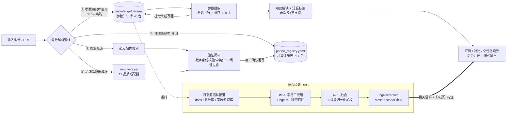

# 📱 AI手机参数提取与评测系统

面向手机选购场景的全链路 RAG 应用：输入手机型号或官网参数页 URL，自动完成"定位参数页 → 提取结构化参数 → 知识解读与短板标签 → 评测 / 对比 / 个性化建议"，生成内容自动检索本地知识库并标注【来源】，可溯源。

> **在线体验**：http://112.74.101.54:8501 （阿里云轻量 2C2G 个人服务器，个人项目请轻拍）

## 数据规模与性能

| 指标 | 数值 |
| --- | --- |
| 参数知识库 | 78 台机型完整结构化参数（提取完成自动写回） |
| 机型注册表 | 71+ 台 / 11 品牌（别名桥接，多种写法全命中） |
| RAG 语料 | 121 文档 / 551 语料块（bge-m3 全部向量化） |
| 检索评测 | 14 例命中率 100%（`rag_eval.yaml`，开发者面板一键回归） |
| 提取性能 | 单机 10 段并行 20~45s；知识库直取 0.01s 离线零 API |
| 生成性能 | 双机对比并行 5.5s（串行基线 60s）；流式输出 |
| 累计 API 成本 | < 5 元（DeepSeek flash + 硅基流动免费模型） |

## 系统架构（V3.0 全链路 RAG）



> **数据飞轮**：提取完成自动写回参数知识库，用户确认候选自动写回注册表——系统越用越聪明。**可溯源机制**：生成管线自动检索相关语料注入 prompt，要求句末标注【来源：xx】；检索语料与参数冲突时以参数为准，无相关内容则忽略——"客观可溯源"从口号变成机制。

### 混合检索（自研，零检索框架/零向量数据库）

- **分词**：字符二元组 + 一元组 + 整段直配（中文友好，无 jieba 依赖）
- **稀疏召回**：自研 Okapi BM25（k1=1.5, b=0.75，IDF 加权 + 长度归一）
- **稠密召回**：bge-m3 向量（硅基流动 API，缺 Key 自动降级纯 BM25），纯 Python 余弦
- **融合**：RRF（k=60）+ 机型归一化全串包含加权 + 余弦同分决胜
- **重排**：bge-reranker-v2-m3 cross-encoder，取融合 Top12 精排出 TopK
- **工程**：语料哈希比对增量向量化（md5 缓存）、chunk_idx 全局唯一（修复过 RRF 融合桶塌缩）、检索评测集回归

## 核心功能

- **型号自动定位**：知识库直取 → 注册表 → 品牌模板 → 搜索验证兜底；验证闭环（数字身份硬校验，X30000≠X300）杜绝张冠李戴，不存在的型号诚实返回空
- **结构化参数提取**：抓取 → 智能分段 → 分段并行提取 → 深度合并（冲突检测），输出统一 JSON
- **可溯源生成**：评测 / 双机多机对比 / 个性化建议三类生成自动注入检索语料并标注来源
- **专业知识解读与标签**：策展知识库覆盖芯片（三级匹配）/ 屏幕 / 电池 / 相机 / 品牌；短板标签基于明确证据，不做"未提及即不支持"的推断
- **外观分析**（多模态）：人工策展图源（上传/URL），视觉模型分析设计语言并自主甄别非产品图
- **五维透明评分**：性能 / 屏幕 / 续航 / 影像 / 性价比规则化评分，对比柱状图即时渲染
- **双视图**：访客视图（干净）/ 开发者模式（密码门：注册表可视化、手动补录、冲突明细、RAG 面板、缓存与密钥工具）
- **批量导入**：`批量导入.py` 支持 URL 清单批量提取（分流 / 质量门 / 重试），53 条 URL 实测 29 台一次全成功

## 技术栈

| 层 | 方案 |
| --- | --- |
| 前端 | Streamlit（访客 / 开发者双视图，后台任务轮询 + 流式） |
| 检索 | 自研 BM25 + bge-m3 + RRF + bge-reranker-v2-m3（`rag.py`，零检索框架） |
| 大模型 | DeepSeek API（提取 / 生成 / 视觉分析 / 品牌分类） |
| 网页抓取 | Jina Reader（Docker 自托管，渲染 JS 重度官网） |
| 数据层 | YAML 注册表 + 策展知识库 + JSON 参数库 + `scoring.py` 五维评分 |
| 部署 | 阿里云轻量 2C2G：Docker（Reader）+ systemd（Streamlit）双层自愈，`deploy/` 运维三件套 |

## 快速开始

### 1. 安装依赖

```bash
git clone https://github.com/kjhgfk687-alt/ai-phone-review-system.git
cd ai-phone-review-system
python -m venv .venv
.venv\Scripts\activate        # Windows
# source .venv/bin/activate   # macOS / Linux
pip install -r requirements.txt
```

### 2. 配置 `.env`

```bash
copy .env.example .env         # Windows
```

- `DEEPSEEK_API_KEY`（必填）：在 [DeepSeek 开放平台](https://platform.deepseek.com/) 申请
- `EMBEDDING_API_KEY`（可选）：硅基流动申请，启用向量召回 + 重排；缺省自动降级纯 BM25
- `DEV_PASSWORD`（可选）：自行设置，解锁开发者模式；留空则开发者模式不可用

### 3. 启动本地 Jina Reader

```bash
docker run -d --name reader -p 127.0.0.1:3001:8081 ghcr.io/jina-ai/reader:main
```

> 端口映射如与示例不同，请在 `.env` 中修改 `JINA_READER_URL`。

### 4. 运行

```bash
streamlit run streamlit_app.py
```

首次运行或语料变更后重建 RAG 索引：

```bash
python -c "import rag; rag.rebuild_index()"
```

浏览器打开提示的地址（默认 `http://localhost:8501`）。三种用法：

1. **输型号**（推荐）：如 `红米K80`、`小米15`，知识库命中的机型 0.01s 秒回
2. **贴 URL**：直接粘贴官网参数页地址（"高级"区）
3. **命令行**：`python cshi.py`（交互式）

## 新品牌接入指南

在 `resolvers.py` 的 `BRAND_ADAPTERS` 中添加一个条目即可，无需改动任何执行代码：

```python
"品牌名": {
    "keywords": ["brand", "中文品牌词"],      # 型号输入中的品牌识别词
    "domains": ["www.brand.cn"],             # 官网域名（搜索过滤用）
    "search_brand": "品牌名",                 # 搜索查询拼接的品牌词
    "slug_rule": "dash",                     # dash=小写横杠 / concat=小写连写
    "slug_strip": ["brand"],                 # 生成 slug 前剔除的词
    "spec_templates": ["https://www.brand.cn/{slug}/specs/"],  # 参数页URL模板
    "landing_from_spec": "strip_specs",      # 参数页→主图页推导规则
    "image_exclude": ["kv", "banner", "logo", "icon", ".svg"],
    "spec_markers": ["specs", "spec", "param"],
}
```

## 项目结构

```
├── streamlit_app.py        # Web 界面（访客/开发者双视图、后台任务轮询、外观图廊）
├── cshi.py                 # 核心流程：抓取/分段/提取/合并/标签/四类生成/后台任务/图片
├── model_finder.py         # 型号解析执行层：搜索/验证闭环/数据飞轮
├── registry.py             # 数据层：机型注册表读写/别名匹配/统计
├── resolvers.py            # 策略层：品牌适配器/文本归一化
├── knowledge_store.py      # 参数知识库（提取写回/别名桥接/离线直取）
├── knowledge_base.py       # 策展知识库查询与匹配逻辑
├── scoring.py              # 五维透明评分（对比柱状图）
├── rag.py                  # 混合检索 RAG：语料管道/BM25/向量/RRF/重排/评测
├── 批量导入.py              # URL 清单批量提取工具
├── knowledge/
│   ├── params/             # 参数知识库（78 台，RAG 语料）
│   └── docs/               # 手写文档语料（丢 Markdown + 重建索引即扩 RAG）
├── phone_registry.yaml     # 机型注册表（数据资产，人工可维护）
├── phone_knowledge.yaml    # 策展知识库（芯片/屏幕/电池/相机/品牌）
├── rag_eval.yaml           # 检索评测集（14 例）
├── deploy/                 # 云端运维三件套（install/update/backup）
└── .env.example            # 配置模板
```

## 已知限制与规划

- 知识库与注册表为人工维护的 YAML，多端写入未加锁（单用户场景可接受，多用户需迁移数据库，schema 已对齐可平迁）
- 评测基于官方参数生成，无法覆盖实际手感、发热、拍照样张等体验维度
- 未收录品牌的模板命中率为搜索兜底所限，会持续扩充适配器
- 当前 HTTP 明文访问，域名备案后升级 HTTPS
- 规划中：检索评测集随语料扩充、任务状态落盘、pytest 收编、多用户改造

## 许可与引用

本项目为个人作品，仅供学习交流。
