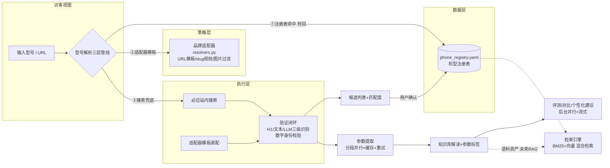

# 📱 AI手机参数提取与评测系统

面向手机选购场景的 AI 辅助工具：输入手机型号或官网参数页 URL，自动定位参数页并提取结构化参数，结合本地知识库生成大白话解读与短板标签，支持单机评测、多机横向对比、个性化选购建议与官方渲染图外观分析。

## 系统架构（V2.0 数据驱动）



> 数据飞轮：用户每次确认候选都会写回注册表，长尾特例降维成一条数据；注册表与知识库是未来 RAG 的语料资产底座（V2.0 只铺路，检索引擎在演进路线中）。

## 新品牌接入指南

在 `resolvers.py` 的 `BRAND_ADAPTERS` 中添加一个条目即可，无需改动任何执行代码：

```python
"品牌名": {
    "keywords": ["brand", "中文品牌词"],      # 型号输入中的品牌识别词
    "domains": ["www.brand.cn"],             # 官网域名（搜索过滤用）
    "search_brand": "品牌名",                 # 搜索查询拼接的品牌词
    "slug_rule": "dash",                     # dash=小写横杠 / concat=小写连写
    "slug_strip": ["brand"],                 # 生成 slug 前剔除的词
    "spec_templates": ["https://www.brand.cn/{slug}/specs/"],  # 参数页URL模板
    "landing_from_spec": "strip_specs",      # 参数页→主图页推导规则
    "image_exclude": ["kv", "banner", "logo", "icon", ".svg"],
    "spec_markers": ["specs", "spec", "param"],
}
```

## 核心功能

- **型号自动定位**：输型号自动找参数页——注册表命中秒回 → 品牌模板直配 → 搜索验证兜底，验证闭环（数字身份校验/中英归一/置信度阈值）杜绝张冠李戴
- **结构化参数提取**：抓取 → 智能分段 → 分段并行提取 → 深度合并（冲突检测），输出统一 JSON
- **专业知识解读**：本地 YAML 知识库覆盖芯片（三级匹配）、屏幕、电池、相机、品牌等维度
- **参数标签**：基于明确证据检测短板与亮点（数字身份级精度，不做"未提及即不支持"的推断）
- **单机评测 / 多机对比 / 个性化建议**：用户画像驱动语言风格与内容侧重，后台并行生成互不阻塞，流式输出
- **外观分析**（多模态）：官网渲染图经视觉模型分析设计语言与配色，自动甄别非产品图
- **双视图**：访客视图（干净）/ 演示者视图（注册表可视化、手动补录、冲突明细、缓存管理）

## 技术栈

| 层 | 方案 |
| --- | --- |
| 前端 | Streamlit（双视图：访客/演示者） |
| 后端 | Python（cshi.py 核心流程 / model_finder.py 型号解析 / registry.py 数据层 / resolvers.py 品牌适配器 / knowledge_base.py 知识库） |
| 大模型 | DeepSeek API（参数提取 / 评测生成 / 视觉分析 / 品牌分类） |
| 网页抓取 | Jina Reader（本地 Docker 部署） |
| 数据 | phone_registry.yaml 机型注册表 + phone_knowledge.yaml 知识库 |

## 快速开始

### 1. 安装依赖

```bash
git clone https://github.com/kjhgfk687-alt/ai-phone-review-system.git
cd ai-phone-review-system
python -m venv .venv
.venv\Scripts\activate        # Windows
# source .venv/bin/activate   # macOS / Linux
pip install -r requirements.txt
```

### 2. 配置 API Key

```bash
copy .env.example .env         # Windows
```

编辑 `.env`，填入你的 `DEEPSEEK_API_KEY`（在 [DeepSeek 开放平台](https://platform.deepseek.com/) 申请）。

### 3. 启动本地 Jina Reader

```bash
docker run -d -p 3001:8081 jinaai/reader
```

> 端口映射如与示例不同，请在 `.env` 中修改 `JINA_READER_URL`。

### 4. 运行

```bash
streamlit run streamlit_app.py
```

浏览器打开提示的地址（默认 `http://localhost:8501`）。三种用法：

1. **输型号**（推荐）：在"按型号自动查找"输入如 `红米K70`，确认候选后自动提取
2. **贴 URL**：直接粘贴官网参数页地址
3. **命令行**：`python cshi.py`（交互式）

## 项目结构

```
├── streamlit_app.py        # Web 界面（访客/演示者双视图）
├── cshi.py                 # 核心流程：抓取/分段/提取/合并/标签/评测/外观分析
├── model_finder.py         # 型号解析执行层：搜索/验证闭环/数据飞轮
├── registry.py             # 数据层：机型注册表读写/别名匹配/统计
├── resolvers.py            # 策略层：品牌适配器/文本归一化
├── knowledge_base.py       # 知识库查询与匹配逻辑
├── phone_registry.yaml     # 机型注册表（数据资产，人工可维护）
├── phone_knowledge.yaml    # 静态知识库（芯片/屏幕/电池/相机/品牌等）
├── cache/                  # 网页与结果缓存（gitignore）
├── .env.example            # 配置模板
└── CHANGELOG.md / 改进方法.md
```

## 已知限制与规划

- 知识库与注册表为人工维护的 YAML，注册表已按 RAG 语料标准设计字段（溯源/时间戳/状态位），检索引擎（BM25+向量混合）在演进路线中
- 评测基于官方参数生成，无法覆盖实际手感、发热、拍照样张等体验维度
- 未收录品牌的模板命中率为搜索兜底所限，会持续扩充适配器
- 规划中：RAG 知识检索、云端部署（多用户）、多模态评测扩展

## 许可与引用

产品背景调研与设计详见《AI手机参数提取与评测系统产品文档》。本项目为个人作品，仅供学习交流。
